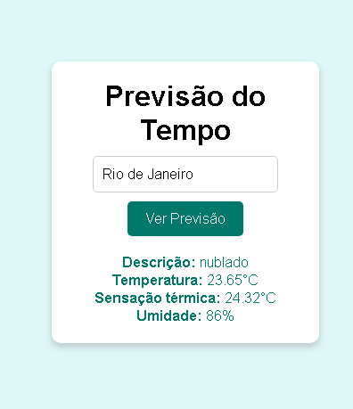
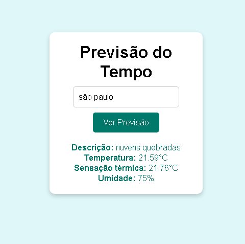

🌤️ Weather Forecast App (Previsor do Tempo)

Aplicação web desenvolvida para consulta de condições climáticas em tempo real, permitindo ao usuário buscar qualquer cidade e visualizar dados atualizados de forma rápida, clara e intuitiva.

🔗 Live Demo:
https://previsor-tempo.netlify.app/

📸 Preview
Interface da aplicação

  

  

🚀 Principais Funcionalidades
Busca de clima por nome da cidade
Exibição de temperatura atual
Descrição das condições climáticas
Atualização dinâmica dos dados via API
Interface limpa e de fácil usabilidade
🧠 Destaques Técnicos

Este projeto demonstra na prática:

Integração com API externa (requisições HTTP)
Manipulação do DOM com JavaScript puro
Tratamento de dados recebidos da API
Estruturação de código para aplicações front-end
Boas práticas de organização de projeto
🛠️ Tecnologias Utilizadas
HTML5
CSS3
JavaScript (ES6+)
API de previsão do tempo
📂 Estrutura do Projeto
📁 weather-app
 ├── index.html
 ├── style.css
 ├── script.js
 └── assets/
⚙️ Como Executar Localmente
# Clone o repositório
git clone https://github.com/Silvaguedes/previsor-do-tempo.git

# Acesse a pasta
cd seu-repositorio

# Abra o index.html no navegador
🎯 Objetivo

Este projeto foi desenvolvido com foco em consolidar conhecimentos em desenvolvimento front-end, especialmente no consumo de APIs e na criação de interfaces dinâmicas.

Também faz parte do meu portfólio, com o objetivo de demonstrar habilidades práticas na construção de aplicações web funcionais.

  

  

📌 Próximas Melhorias
Previsão para múltiplos dias
Exibição de dados adicionais (vento, umidade, sensação térmica)
Implementação de loading state
Tratamento de erros (ex: cidade inválida)
Responsividade aprimorada
Modo escuro
👨‍💻 Autor

Desenvolvido por Aldair
